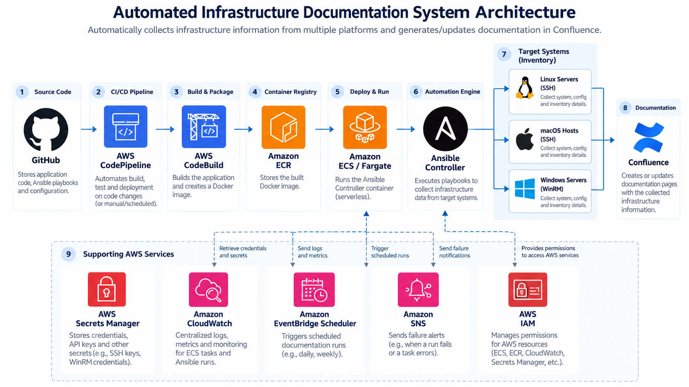

# Automated Infrastructure Documentation System

A cross-platform infrastructure documentation automation platform built with Ansible, Docker, AWS, and Confluence.

The system automatically connects to managed hosts, gathers infrastructure facts, generates documentation, and publishes or updates Confluence pages. It supports Linux, macOS, and Windows targets from a single containerized Ansible controller.

---

## Project Overview

This project was originally built as an automated documentation system using Ansible and Confluence.

It was later extended into a cloud-hosted, cross-platform automation platform using AWS ECS Fargate, Amazon ECR, AWS Secrets Manager, EventBridge Scheduler, CloudWatch, SNS, CodePipeline, and CodeBuild.

The final implementation supports:

- Linux targets over SSH
- macOS targets over SSH
- Windows targets over WinRM
- Automated Confluence page creation and updates
- Dockerized Ansible execution
- AWS-hosted execution with ECS Fargate
- Secure credential storage with AWS Secrets Manager
- Scheduled execution with EventBridge Scheduler
- Centralized logging with CloudWatch
- Failure alerts through SNS
- CI/CD from GitHub to ECR using CodePipeline and CodeBuild

---

## Architecture



---

## Core Technologies

### Automation

- Ansible
- Python
- YAML
- WinRM
- SSH

### Containerization

- Docker
- Docker Buildx

### AWS

- Amazon ECS
- AWS Fargate
- Amazon ECR
- AWS Secrets Manager
- AWS CodePipeline
- AWS CodeBuild
- Amazon EventBridge Scheduler
- Amazon CloudWatch
- Amazon SNS
- AWS IAM

### Documentation

- Atlassian Confluence REST API

---

## Cross-Platform Support

The controller supports three target operating system families.

| Platform | Connection Method | Status |
|---|---|---|
| Linux | SSH | Tested |
| macOS | SSH | Tested |
| Windows | WinRM / NTLM | Tested |

The same Ansible controller can gather facts from all three target types.

---

## Project Structure

```text
CapstoneUndergrad/
|
├── Dockerfile
├── entrypoint.sh
├── buildspec.yml
├── .dockerignore
├── .gitignore
|
├── playbooks/
│   ├── confluence.yml
│   ├── inventory.yml
│   ├── createConfluencePage.yml
│   ├── dockerTest.yml
│   └── callback/
│       ├── EPlugin.py
│       └── ansible.cfg
|
└── README.md
```

---

## How It Works

The workflow is:

1. The Ansible controller starts inside Docker or AWS Fargate.
2. The controller prepares the required target connection.
3. Linux and macOS hosts are reached over SSH.
4. Windows hosts are reached through WinRM.
5. Ansible gathers infrastructure facts from the target.
6. The playbook converts the facts into HTML documentation.
7. The controller searches Confluence for an existing documentation page.
8. If the page does not exist, it is created.
9. If the page already exists, it is updated.
10. AWS-hosted runs write execution logs to CloudWatch.
11. Scheduled runs are triggered through EventBridge Scheduler.
12. Failed ECS tasks can trigger SNS email notifications.

---

## Example Generated Documentation

Each managed host receives its own Confluence page.

Examples:

```text
ec2_test_server - Infrastructure Documentation
mac_test - Infrastructure Documentation
windows_test - Infrastructure Documentation
```

Generated system details can include:

- Hostname
- FQDN
- Operating system
- OS family
- CPU architecture
- Processor count
- Virtual CPUs
- Total memory
- Kernel
- Virtualization type
- Virtualization role

---

## Inventory Design

Targets are organized by operating system.

```yaml
all:
  children:

    linux_hosts:
      hosts:
        ec2_test_server:

    mac_hosts:
      hosts:
        mac_test:

    windows_hosts:
      hosts:
        windows_test:
```

Linux and macOS use SSH.

Windows uses WinRM with NTLM authentication.

---

## Environment Variables

The application expects environment variables for target connectivity and Confluence authentication.

### Confluence

```text
CONFLUENCE_API_TOKEN
```

### Linux

```text
LINUX_TARGET_HOST
EC2_SSH_PRIVATE_KEY
```

### macOS

```text
MAC_TARGET_HOST
MAC_USERNAME
MAC_SSH_PRIVATE_KEY
```

### Windows

```text
WINDOWS_TARGET_HOST
WINDOWS_USERNAME
WINDOWS_PASSWORD
```

Sensitive values should never be committed to Git.

Local secrets can be stored in `.env` files that are ignored by Git.

AWS-hosted secrets are stored in AWS Secrets Manager.

---

## Local Docker Execution

Build the image:

```bash
docker build -t capstone-doc-automation .
```

### Linux

```bash
docker run --rm \
  --env-file .env \
  -e LINUX_TARGET_HOST=<LINUX_IP> \
  -e EC2_SSH_PRIVATE_KEY="$(cat ~/.ssh/<key>)" \
  capstone-doc-automation \
  ansible-playbook -i inventory.yml confluence.yml \
  --tags publish \
  --limit linux_hosts
```

### macOS

```bash
docker run --rm \
  --env-file .env \
  -e MAC_TARGET_HOST=<MAC_IP> \
  -e MAC_USERNAME=<USERNAME> \
  -e MAC_SSH_PRIVATE_KEY="$(cat ~/.ssh/<key>)" \
  capstone-doc-automation \
  ansible-playbook -i inventory.yml confluence.yml \
  --tags publish \
  --limit mac_hosts
```

### Windows

```bash
docker run --rm \
  --env-file .env \
  -e WINDOWS_TARGET_HOST=<WINDOWS_IP> \
  -e WINDOWS_USERNAME='<WINDOWS_USERNAME>' \
  -e WINDOWS_PASSWORD='<WINDOWS_PASSWORD>' \
  capstone-doc-automation \
  ansible-playbook -i inventory.yml confluence.yml \
  --tags publish \
  --limit windows_hosts
```

---

## AWS Deployment

The Docker image is stored in Amazon ECR.

The application runs as a standalone ECS Fargate task.

The Fargate task uses:

- Linux / ARM64
- 0.25 vCPU
- 0.5 GB memory
- AWS Secrets Manager for secrets
- CloudWatch Logs for task output

The task can be triggered manually or through EventBridge Scheduler.

---

## CI/CD Pipeline

The repository is connected to AWS CodePipeline.

The pipeline performs:

```text
GitHub push
    |
    v
CodePipeline
    |
    v
CodeBuild
    |
    v
Docker ARM64 build
    |
    v
Amazon ECR
```

The build process is defined in:

```text
buildspec.yml
```

CodeBuild authenticates to ECR, builds the Docker image, tags it, and pushes the latest image.

---

## Scheduling

Amazon EventBridge Scheduler is used to run the documentation task automatically.

The scheduled task launches the ECS Fargate task, which:

1. starts the controller,
2. connects to the target infrastructure,
3. gathers facts,
4. publishes documentation,
5. exits.

This makes the system event-driven rather than requiring a continuously running server.

---

## Monitoring and Alerts

### CloudWatch

ECS task logs are written to:

```text
/ecs/capstone-doc-automation
```

CloudWatch provides visibility into:

- task startup
- target connectivity
- Ansible execution
- documentation publication
- failures

### SNS Failure Alerts

An EventBridge rule watches for ECS tasks that stop with a non-zero exit code.

When a failure is detected:

```text
ECS Task Failure
      |
      v
EventBridge Rule
      |
      v
Amazon SNS
      |
      v
Email Alert
```

---

## Security

The project was designed to avoid storing secrets directly in source control.

Security controls include:

- Confluence API tokens stored in AWS Secrets Manager
- SSH private keys stored in AWS Secrets Manager
- Windows credentials passed as runtime secrets
- `.env` files excluded through `.gitignore`
- SSH keys excluded from Docker build context
- Confluence API tasks use `no_log: true`
- environment facts are excluded during Ansible fact collection
- IAM roles are used for AWS service permissions
- the ECS task retrieves secrets at runtime

---

## Testing

The following target types were tested successfully.

### Linux

Tested against an Amazon Linux EC2 instance.

Result:

```text
unreachable=0
failed=0
```

### macOS

Tested against a macOS machine using SSH.

Result:

```text
unreachable=0
failed=0
```

### Windows

Tested against a Windows machine using WinRM and NTLM.

Result:

```text
unreachable=0
failed=0
```

Each test successfully generated or updated a Confluence infrastructure documentation page.

---

## Design Decisions

### Why Ansible?

Ansible provides a consistent automation framework across heterogeneous infrastructure.

It supports Linux and macOS over SSH and Windows through WinRM.

### Why Fargate?

The documentation process is a short-lived batch workload.

Fargate allows the controller to run only when required without maintaining a dedicated EC2 control server.

### Why Secrets Manager?

Secrets Manager prevents credentials from being stored directly inside:

- source code
- Docker images
- GitHub
- ECS task definitions

### Why Confluence?

Confluence provides a centralized location for automatically generated infrastructure documentation that can be updated repeatedly.

---

## Current Limitations

The current implementation has several intentional limitations.

- Home or on-premises systems require network connectivity from the controller.
- A Site-to-Site VPN was evaluated but was not required for the completed implementation.
- Windows WinRM must be enabled on Windows targets.
- SSH access must be enabled on Linux and macOS targets.
- The current AWS controller image is ARM64.

Future enhancements could include:

- multi-architecture Docker images
- AWS Site-to-Site VPN connectivity
- multiple dynamic hosts
- inventory discovery
- role-based templates
- richer Confluence pages
- automated Ansible lint and syntax checks in CI
- immutable image versioning using Git commit SHA tags

---

## Future Improvements

Potential next steps include:

- build and push `linux/amd64` and `linux/arm64` images
- add automated testing to CodeBuild
- dynamically discover hosts instead of using static inventory entries
- add additional Windows documentation fields
- create richer OS-specific documentation templates
- version container images by commit SHA
- add AWS Site-to-Site VPN for hybrid network access
- expand CloudWatch monitoring and metrics

---

## Outcome

The final system demonstrates:

- infrastructure automation
- cross-platform systems management
- containerization
- AWS serverless compute
- CI/CD
- secure secret management
- monitoring and alerting
- REST API integration
- scheduled automation
- automated technical documentation

The result is a reusable documentation automation platform capable of managing Linux, macOS, and Windows infrastructure from a single Ansible control plane.
